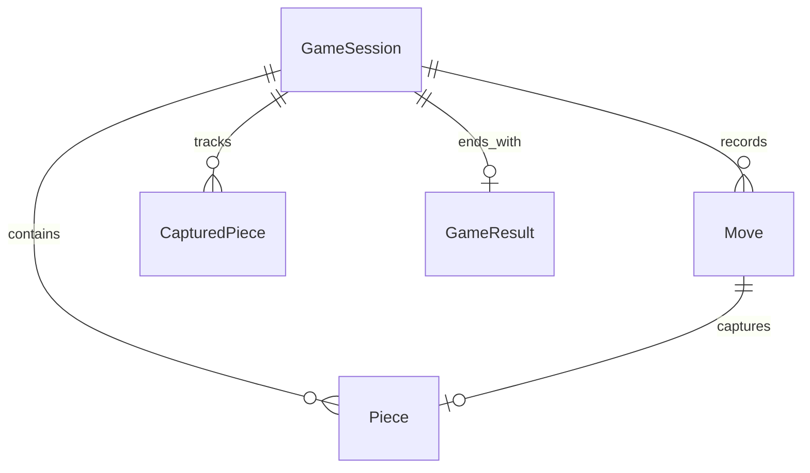
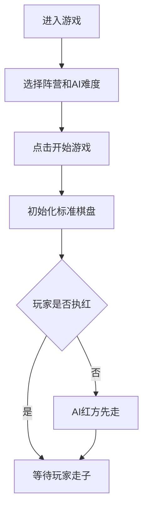
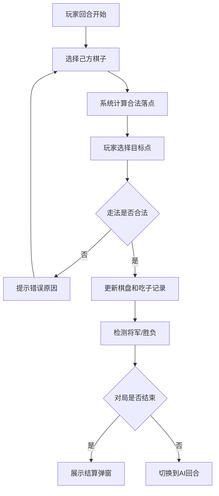
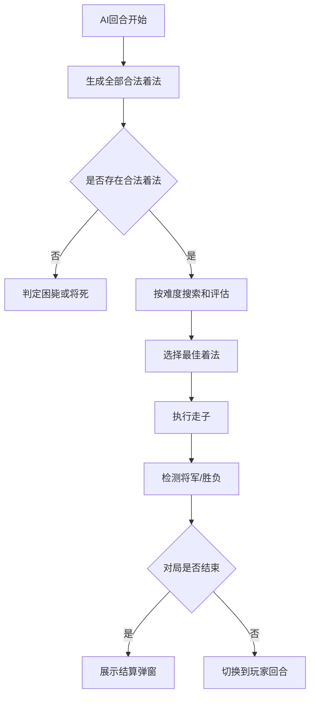
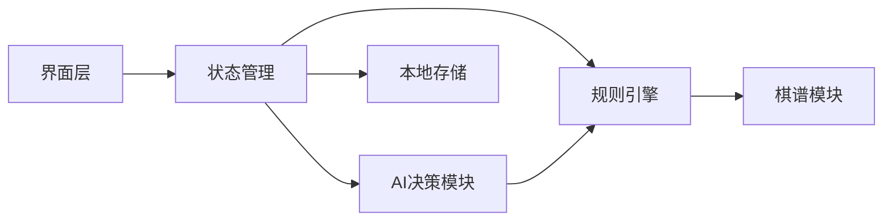

# 中国象棋游戏 PRD（产品需求文档）

---

## 1. 文档概述

### 1.1 文档信息

| 项目 | 内容 |
|------|------|
| 文档名称 | 中国象棋游戏产品需求文档 |
| 文档版本 | v1.0 |
| 创建日期 | 2026-04-28 |
| 文档状态 | 草稿 |
| 目标受众 | 产品、设计、前端、后端、测试、项目负责人 |

### 1.2 修订历史

| 版本 | 日期 | 修订人 | 修订内容 |
|------|------|--------|----------|
| v1.0 | 2026-04-28 | - | 初始版本创建 |

### 1.3 项目背景

中国象棋是国内用户认知度高、规则成熟、策略深度强的双人棋类游戏。项目目标是开发一款轻量级 Web 版中国象棋游戏，优先支持单机人机对弈，让用户无需下载客户端即可快速开始一局对战，并通过规则提示、走法高亮和不同 AI 难度降低新手门槛。

**项目特点：**
- 支持真人玩家与电脑 AI 对弈。
- 完整实现中国象棋标准棋盘、棋子走法、将军、将死、困毙和胜负判定。
- 提供走法提示、悔棋、棋谱记录和本地对局恢复。
- 后续可扩展在线匹配、残局练习、棋谱分析和排行榜。

---

## 2. 产品概述

### 2.1 产品定位

一款面向休闲玩家和象棋学习者的轻量级中国象棋游戏，提供浏览器即开即玩的人机对战和规则辅助体验。

### 2.2 目标用户

| 用户角色 | 人数/规模 | 主要诉求 |
|----------|----------|----------|
| 休闲玩家 | 大众用户 | 快速开局，完成一局流畅的人机对弈 |
| 象棋新手 | 入门用户 | 了解棋子走法、合法落点、将军和胜负规则 |
| 进阶玩家 | 中高频用户 | 选择更高难度 AI，进行日常练习 |
| 测试/运营人员 | 内部用户 | 验证规则、AI、棋谱、异常局面和兼容性 |

### 2.3 核心价值

1. **即开即玩**：用户无需注册或下载，进入页面即可开始人机对战。
2. **规则准确**：完整覆盖棋子走法、蹩马腿、塞象眼、将帅照面、将军、将死和困毙等核心规则。
3. **学习友好**：通过合法落点、错误原因、棋子说明和提示功能降低学习成本。
4. **体验连续**：支持悔棋、重开、本地存档和棋谱记录，减少中断带来的挫败感。

---

## 3. 角色与权限体系

### 3.1 角色定义

#### 3.1.1 真人玩家

用户实际操作的一方，默认执红先行。可选择棋子、移动棋子、查看提示、悔棋、重开、调整难度和查看棋谱。

#### 3.1.2 电脑玩家

系统控制的一方，默认执黑后行。根据当前局面、难度配置和搜索策略自动选择合法着法。

#### 3.1.3 系统裁判

规则引擎角色。负责初始化棋盘、校验走法、检测将军、判定胜负、记录棋谱、流转回合和处理异常状态。

### 3.2 权限矩阵

| 功能模块 | 真人玩家 | 电脑玩家 | 系统裁判 |
|----------|:--------:|:--------:|:--------:|
| 开始新局 | ✓ | ✗ | ✓ |
| 选择阵营 | ✓ | ✗ | ✓ |
| 移动棋子 | ✓ | ✓ | ✓ |
| 合法性校验 | ✗ | ✗ | ✓ |
| 自动决策 | ✗ | ✓ | ✗ |
| 悔棋 | ✓ | ✗ | ✓ |
| 胜负判定 | ✗ | ✗ | ✓ |
| 棋谱记录 | ✓ | ✗ | ✓ |
| 本地存档 | ✓ | ✗ | ✓ |
| 设置难度 | ✓ | ✗ | ✓ |

> ✓：有权限或执行职责；✗：无权限或不负责。

---

## 4. 功能需求

### 4.1 P0：核心功能（MVP）

#### 4.1.1 游戏初始化

| 功能编号 | 功能名称 | 功能描述 | 验收标准 |
|----------|----------|----------|----------|
| F001 | 新建对局 | 用户点击“开始游戏”后创建一局中国象棋对战 | 棋盘、棋子、回合、阵营和历史记录初始化正确 |
| F002 | 标准棋盘 | 渲染 9 路 x 10 横线中国象棋棋盘，包含九宫、楚河汉界和坐标 | 棋盘结构符合中国象棋标准布局 |
| F003 | 标准开局 | 按标准位置摆放红黑双方 32 枚棋子 | 每方 16 枚棋子，位置、名称、阵营无误 |
| F004 | 阵营选择 | 支持玩家选择红方或黑方，默认红方先行 | 选择黑方时 AI 自动先走红方第一步 |
| F005 | 难度选择 | 支持简单、普通、困难三档 AI 难度 | 开局前可选择难度，默认普通 |

#### 4.1.2 棋子操作

| 功能编号 | 功能名称 | 功能描述 | 验收标准 |
|----------|----------|----------|----------|
| F011 | 选择棋子 | 玩家点击己方棋子后进入选中状态 | 选中棋子有明显高亮，不能选中对方棋子 |
| F012 | 合法落点提示 | 选中棋子后展示可走位置和可吃位置 | 所有提示位置均为规则允许的落点 |
| F013 | 移动棋子 | 玩家点击合法落点完成移动 | 棋子移动后棋盘状态、回合和历史记录同步更新 |
| F014 | 吃子 | 玩家移动到对方棋子位置时完成吃子 | 被吃棋子从棋盘移除并进入吃子记录 |
| F015 | 取消选择 | 点击空白非法位置或再次点击选中棋子可取消选择 | 取消后高亮和落点提示消失 |

#### 4.1.3 规则引擎

| 功能编号 | 功能名称 | 功能描述 | 验收标准 |
|----------|----------|----------|----------|
| F021 | 车走法 | 车横竖直线行走，路径中不能有棋子 | 横竖无阻挡可走，有阻挡不可越过 |
| F022 | 马走法 | 马走日字，受蹩马腿限制 | 马腿位置有棋子时对应落点不可走 |
| F023 | 相/象走法 | 相/象走田字，受塞象眼限制，不能过河 | 象眼有棋子不可走，红相不越过河界到黑方区域，黑象同理 |
| F024 | 仕/士走法 | 仕/士在己方九宫内沿斜线走一格 | 不能出九宫，不能直走 |
| F025 | 帅/将走法 | 帅/将在九宫内横竖走一格 | 不能出九宫，不能进入被攻击位置 |
| F026 | 炮走法 | 炮不吃子时同车走法，吃子时中间必须隔一个棋子 | 隔一个炮架可吃，隔零个或多个不可吃 |
| F027 | 兵/卒走法 | 兵/卒过河前只能向前一格，过河后可向前或左右一格 | 不能后退，过河前不能横走 |
| F028 | 将帅照面 | 将帅在同一路且中间无棋子时为非法局面 | 任何导致将帅照面的走法不可提交 |
| F029 | 自陷将军禁止 | 玩家不能走出导致己方帅/将被攻击的着法 | 非法着法被阻止并提示原因 |

#### 4.1.4 游戏状态与胜负

| 功能编号 | 功能名称 | 功能描述 | 验收标准 |
|----------|----------|----------|----------|
| F031 | 回合流转 | 红方先行，双方轮流行动 | 每次合法走子后切换到对方回合 |
| F032 | 将军检测 | 一方走子后若攻击对方帅/将，展示将军提示 | 被将军方有明显状态提示 |
| F033 | 应将限制 | 被将军方必须走出解除将军的合法着法 | 不能提交无法解除将军的走法 |
| F034 | 将死判定 | 被将军方无任何合法应将着法时判负 | 展示胜负结果和结束弹窗 |
| F035 | 困毙判定 | 当前方未被将军但无任何合法着法时判负 | 展示困毙原因和胜负结果 |
| F036 | 长将/重复局面提示 | MVP 至少记录重复局面并提示可能重复 | 不强制复杂判和规则，后续迭代完善 |

#### 4.1.5 电脑 AI

| 功能编号 | 功能名称 | 功能描述 | 验收标准 |
|----------|----------|----------|----------|
| F041 | AI 合法走子 | AI 在自己的回合自动选择合法着法 | AI 不产生非法走法，不导致己方被将军 |
| F042 | AI 难度策略 | 简单、普通、困难采用不同搜索深度和评估强度 | 不同难度在响应时间和棋力上有明显差异 |
| F043 | AI 思考状态 | AI 行动前展示“思考中”状态 | 用户能明确知道当前由 AI 行动 |
| F044 | AI 响应时间 | AI 在可接受时间内完成决策 | 简单/普通 < 1 秒，困难 < 3 秒 |

#### 4.1.6 基础界面与控制

| 功能编号 | 功能名称 | 功能描述 | 验收标准 |
|----------|----------|----------|----------|
| F051 | 主棋盘界面 | 展示棋盘、棋子、当前回合、双方信息和操作区 | 首屏信息完整，核心操作不被遮挡 |
| F052 | 操作按钮 | 提供新局、悔棋、提示、认输、设置等按钮 | 不可用操作置灰或隐藏 |
| F053 | 棋谱记录 | 记录每一步走法、回合数和吃子信息 | 每次合法走子后追加一条记录 |
| F054 | 吃子展示 | 展示双方已吃掉的棋子 | 吃子后记录实时更新 |
| F055 | 结算弹窗 | 对局结束后展示胜负方、结束原因和操作入口 | 用户可选择再来一局或查看棋谱 |

### 4.2 P1：重要功能

| 功能编号 | 功能名称 | 功能描述 | 验收标准 |
|----------|----------|----------|----------|
| F101 | 悔棋 | 支持玩家悔回上一轮双方各一步 | 悔棋后棋盘、吃子、回合和棋谱恢复一致 |
| F102 | 走法提示 | 系统推荐一手可行着法 | 点击提示后高亮推荐棋子和目标点 |
| F103 | 本地存档 | 对局状态保存到浏览器本地 | 刷新页面后可恢复未结束对局 |
| F104 | 音效反馈 | 支持走子、吃子、将军、胜负音效 | 用户可开启或关闭音效 |
| F105 | 棋盘主题 | 支持至少 2 套棋盘和棋子主题 | 设置后即时生效或下局生效 |
| F106 | 新手说明 | 点击棋子可查看该棋子的走法说明 | 新手能理解当前棋子的基本规则 |
| F107 | 计时器 | 支持单步计时或总用时展示 | 双方用时统计准确 |
| F108 | 棋谱导出 | 支持导出文本格式棋谱 | 导出内容包含完整着法序列和结果 |

### 4.3 P2：增强功能（后续迭代）

| 功能编号 | 功能名称 | 功能描述 |
|----------|----------|----------|
| F201 | 残局练习 | 提供典型杀法、残局和闯关题库 |
| F202 | 在线对战 | 支持真人匹配、房间邀请和实时对弈 |
| F203 | 棋谱复盘 | 支持逐步回放、跳转和关键局面分析 |
| F204 | AI 分析 | 对用户着法进行评分并推荐更优着法 |
| F205 | 排行榜 | 统计胜率、积分、连胜和对局数 |
| F206 | 账号体系 | 支持登录后同步战绩、收藏棋谱和跨设备存档 |
| F207 | 自定义规则 | 支持配置先后手、让子、计时、是否启用重复局面裁定 |

---

## 5. 规则需求

### 5.1 棋盘与阵营

| 项目 | 规则 |
|------|------|
| 棋盘规格 | 9 条竖线、10 条横线，共 90 个交点 |
| 阵营 | 红方与黑方，红方默认先行 |
| 九宫 | 双方底线区域各 3 x 3，帅/将和仕/士只能在己方九宫内活动 |
| 河界 | 中间为楚河汉界，相/象不能过河，兵/卒过河后获得横走能力 |
| 坐标 | 内部可用 x=0-8、y=0-9 表示，红方底线为 y=9 |

### 5.2 棋子配置

| 阵营 | 棋子 | 数量 | 初始位置说明 |
|------|------|:----:|--------------|
| 红方 | 帅 | 1 | 红方九宫底线中路 |
| 红方 | 仕 | 2 | 帅两侧斜线位置 |
| 红方 | 相 | 2 | 底线两侧相位 |
| 红方 | 马 | 2 | 底线马位 |
| 红方 | 车 | 2 | 底线两角 |
| 红方 | 炮 | 2 | 炮位 |
| 红方 | 兵 | 5 | 兵线五个间隔位置 |
| 黑方 | 将、士、象、马、车、炮、卒 | 16 | 与红方对称摆放 |

### 5.3 合法性规则

| 场景 | 规则 |
|------|------|
| 选择限制 | 只能选择当前回合己方棋子 |
| 落点限制 | 不能移动到己方棋子占据的位置 |
| 路径限制 | 车、炮不吃子移动时路径必须无阻挡 |
| 特殊阻挡 | 马受蹩马腿限制，相/象受塞象眼限制 |
| 安全限制 | 走子后己方帅/将不能被攻击 |
| 将帅限制 | 将帅不能在同一路直接照面 |
| 胜负限制 | 对局结束后不能继续走子，除非新开一局或复盘 |

### 5.4 胜负与和棋策略

| 结果 | 判定规则 |
|------|----------|
| 将死 | 当前方被将军且无任何合法应对着法，当前方失败 |
| 困毙 | 当前方未被将军但无任何合法着法，当前方失败 |
| 认输 | 玩家主动点击认输，立即判 AI 获胜 |
| AI 认输 | MVP 不支持 AI 主动认输 |
| 和棋 | MVP 不强制自动和棋；P1/P2 可增加重复局面、长将长捉、自然限着等裁定 |

---

## 6. 非功能需求

### 6.1 性能要求

| 指标 | 要求 | 说明 |
|------|------|------|
| 首屏加载 | < 2 秒 | 常规宽带环境 |
| 操作反馈 | < 100ms | 选棋、落点高亮、按钮点击即时响应 |
| AI 响应时间 | 简单/普通 < 1 秒，困难 < 3 秒 | 避免用户长时间等待 |
| 动画帧率 | 目标 60fps，最低 30fps | 走子、吃子、弹窗动画保持流畅 |
| 存档写入 | < 200ms | 不阻塞用户操作 |

### 6.2 安全要求

| 要求 | 说明 |
|------|------|
| 输入校验 | 所有走子请求必须经过规则引擎校验，不能只依赖前端 UI 限制 |
| 本地数据安全 | 本地存档不保存敏感信息 |
| 防篡改 | 若后续上线排行榜或联机，关键对局结果必须由服务端裁定 |
| 依赖安全 | 第三方棋类库、AI 引擎和 UI 依赖需锁定版本并进行漏洞检查 |

### 6.3 兼容性要求

| 类别 | 要求 |
|------|------|
| 浏览器 | Chrome、Edge、Safari、Firefox 最近两个主版本 |
| 桌面分辨率 | 1366x768 及以上完整可用 |
| 移动端 | 375px 宽度及以上可用，竖屏优先，横屏体验更佳 |
| 输入方式 | 支持鼠标点击和触摸点击 |
| 离线能力 | MVP 可不支持离线；P1 可通过本地缓存支持已加载后离线对弈 |

### 6.4 可用性要求

| 指标 | 要求 |
|------|------|
| 系统可用性 | 单机模式核心功能可用性 ≥ 99% |
| 规则准确率 | P0 标准规则测试用例通过率 100% |
| 崩溃率 | 前端运行时崩溃率 < 0.5% |
| 新手完成率 | 新手用户可在不查外部资料情况下完成第一局 |

---

## 7. 数据模型

### 7.1 核心实体

#### 7.1.1 GameSession（对局）

| 字段名 | 类型 | 必填 | 说明 |
|--------|------|:----:|------|
| id | string | ✓ | 对局唯一 ID |
| status | enum | ✓ | preparing、playing、finished |
| currentSide | enum | ✓ | red、black |
| playerSide | enum | ✓ | 真人玩家阵营 |
| aiDifficulty | enum | ✓ | easy、normal、hard |
| board | Piece[] | ✓ | 当前棋盘棋子列表 |
| moveHistory | Move[] | ✓ | 着法历史 |
| capturedPieces | CapturedPiece[] | ✓ | 被吃棋子记录 |
| result | GameResult | ✗ | 结束结果 |
| createdAt | datetime | ✓ | 创建时间 |
| updatedAt | datetime | ✓ | 更新时间 |

#### 7.1.2 Piece（棋子）

| 字段名 | 类型 | 必填 | 说明 |
|--------|------|:----:|------|
| id | string | ✓ | 棋子唯一 ID |
| side | enum | ✓ | red、black |
| type | enum | ✓ | general、advisor、elephant、horse、chariot、cannon、soldier |
| label | string | ✓ | 展示名称，如帅、将、车、炮 |
| x | number | ✓ | 横坐标 0-8 |
| y | number | ✓ | 纵坐标 0-9 |
| alive | boolean | ✓ | 是否仍在棋盘上 |

#### 7.1.3 Move（着法）

| 字段名 | 类型 | 必填 | 说明 |
|--------|------|:----:|------|
| id | string | ✓ | 着法唯一 ID |
| turnNumber | number | ✓ | 回合数 |
| side | enum | ✓ | 行动方 |
| pieceId | string | ✓ | 移动棋子 ID |
| pieceType | enum | ✓ | 移动棋子类型 |
| fromX | number | ✓ | 起点横坐标 |
| fromY | number | ✓ | 起点纵坐标 |
| toX | number | ✓ | 终点横坐标 |
| toY | number | ✓ | 终点纵坐标 |
| capturedPieceId | string | ✗ | 被吃棋子 ID |
| notation | string | ✓ | 棋谱展示文本 |
| isCheck | boolean | ✓ | 是否将军 |
| createdAt | datetime | ✓ | 走子时间 |

#### 7.1.4 GameResult（对局结果）

| 字段名 | 类型 | 必填 | 说明 |
|--------|------|:----:|------|
| winner | enum | ✓ | red、black、draw |
| reason | enum | ✓ | checkmate、stalemate、resign、draw、timeout |
| finalMoveId | string | ✗ | 结束着法 ID |
| durationSeconds | number | ✓ | 对局总时长 |
| summary | string | ✓ | 结果说明 |

### 7.2 实体关系图（ERD）



---

## 8. 业务流程

### 8.1 开始对局流程



### 8.2 玩家走子流程



### 8.3 AI 行动流程



### 8.4 对局状态流转

| 状态 | 说明 | 可转换状态 |
|------|------|------------|
| preparing | 已进入页面但未开局 | playing |
| playing | 对局进行中 | finished、preparing |
| finished | 对局已结束 | preparing |

---

## 9. 界面设计规范

### 9.1 整体布局

桌面端以棋盘为视觉中心，右侧展示对局信息、棋谱、控制按钮和设置。移动端优先保证棋盘可操作，信息区折叠为底部面板或标签页。

```
┌────────────────────────────────────────────────────┐
│ Header：标题 / 新局 / 设置                          │
├──────────────────────────────┬─────────────────────┤
│                              │  对局信息            │
│                              │  当前回合            │
│          中国象棋棋盘         │  AI难度              │
│                              │  吃子记录            │
│                              │  棋谱列表            │
├──────────────────────────────┴─────────────────────┤
│ 操作区：悔棋 / 提示 / 认输 / 重开                   │
└────────────────────────────────────────────────────┘
```

### 9.2 关键页面说明

#### 9.2.1 游戏主界面

| 元素 | 说明 |
|------|------|
| 棋盘 | 展示 9x10 交点、九宫线、楚河汉界和双方棋子 |
| 棋子 | 使用清晰的中文棋子字样，红黑阵营颜色区分明显 |
| 当前回合 | 展示当前行动方、是否将军、AI 是否思考中 |
| 操作按钮 | 按当前状态展示可用操作，不可用按钮置灰 |
| 棋谱面板 | 按回合记录红黑双方着法，可滚动查看 |
| 吃子区 | 展示双方已吃棋子，辅助判断局势 |

#### 9.2.2 新局设置弹窗

| 元素 | 说明 |
|------|------|
| 阵营选择 | 红方、黑方 |
| AI 难度 | 简单、普通、困难 |
| 计时设置 | MVP 可默认不开启，P1 支持配置 |
| 开始按钮 | 按配置创建新对局 |

#### 9.2.3 结算弹窗

| 元素 | 说明 |
|------|------|
| 胜负结果 | 展示红胜、黑胜或和棋 |
| 结束原因 | 展示将死、困毙、认输等原因 |
| 对局数据 | 展示总回合数、用时、吃子数量 |
| 后续操作 | 再来一局、查看棋谱、返回主页 |

### 9.3 交互原则

| 原则 | 要求 |
|------|------|
| 操作明确 | 选中、可走、可吃、上一步移动都有不同视觉状态 |
| 错误可理解 | 非法走法需要提示具体原因，如“马腿被挡”“将帅照面” |
| 信息不过载 | 默认展示必要信息，高级信息放在折叠面板 |
| 移动端友好 | 棋子点击热区不小于 40px，避免误触 |

---

## 10. 技术建议

### 10.1 技术栈推荐

| 模块 | 建议 | 说明 |
|------|------|------|
| 前端框架 | React / Vue / Svelte | 任选团队熟悉方案 |
| 状态管理 | Zustand / Pinia / Redux Toolkit | 管理棋盘、历史、设置和存档 |
| 样式 | Tailwind CSS / CSS Modules | 快速实现响应式界面 |
| 规则引擎 | 自研 TypeScript 模块 | 中国象棋规则适合独立封装，便于测试 |
| AI 引擎 | Minimax + Alpha-Beta 剪枝 | MVP 可自研，后续可接入更强引擎 |
| 本地存储 | localStorage / IndexedDB | 保存未结束对局和设置 |

### 10.2 架构建议



### 10.3 模块划分

| 模块 | 职责 |
|------|------|
| BoardRenderer | 棋盘和棋子渲染、点击交互、高亮状态 |
| GameStore | 保存当前对局状态、设置和 UI 状态 |
| RuleEngine | 生成合法着法、校验走法、检测将军和胜负 |
| AIEngine | 根据难度和局面选择 AI 着法 |
| NotationService | 生成和导出棋谱文本 |
| PersistenceService | 本地保存和恢复对局 |
| SoundService | 播放走子、吃子、将军和胜负音效 |

### 10.4 开发优先级

| 阶段 | 目标 | 主要交付 |
|------|------|----------|
| Phase 1 | 可走通基础对局 | 棋盘、棋子、标准开局、玩家走子、回合切换 |
| Phase 2 | 完整规则闭环 | 全棋子规则、将军、将死、困毙、非法提示 |
| Phase 3 | 人机对弈 | AI 合法走子、难度配置、思考状态 |
| Phase 4 | 体验完善 | 悔棋、提示、存档、棋谱、音效、主题 |
| Phase 5 | 扩展玩法 | 残局、复盘、在线对战、战绩系统 |

---

## 11. 测试与验收

### 11.1 功能测试重点

| 测试项 | 验收要求 |
|--------|----------|
| 初始布局 | 32 枚棋子位置完全正确 |
| 单棋子走法 | 每类棋子的合法和非法走法均覆盖 |
| 特殊阻挡 | 蹩马腿、塞象眼、炮架、将帅照面测试通过 |
| 将军处理 | 被将军时只能走解除将军的着法 |
| 胜负判定 | 将死、困毙、认输均能正确结束 |
| AI 决策 | AI 每一步均合法，响应时间符合要求 |
| 悔棋恢复 | 棋盘、棋谱、吃子和回合恢复一致 |
| 本地存档 | 刷新恢复后可继续对局 |

### 11.2 规则测试用例要求

| 类型 | 最低用例数 |
|------|:----------:|
| 车、马、相、仕、帅、炮、兵基础走法 | 每类 ≥ 8 个 |
| 蹩马腿、塞象眼、炮架 | 每类 ≥ 6 个 |
| 将帅照面 | ≥ 6 个 |
| 将军、应将、将死、困毙 | 每类 ≥ 5 个 |
| AI 合法性回归 | ≥ 50 个随机局面 |

### 11.3 上线验收标准

| 标准 | 要求 |
|------|------|
| P0 完成度 | P0 功能 100% 完成 |
| 规则测试 | P0 规则测试通过率 100% |
| 主流程 | 玩家可完整完成一局人机对战 |
| 兼容性 | 主流浏览器和移动端基础体验通过 |
| 性能 | 首屏、操作反馈和 AI 响应满足指标 |

---

## 12. 成功指标

| 指标 | 目标 |
|------|------|
| 首局开始率 | ≥ 70% |
| 单局完成率 | ≥ 50% |
| 平均对局时长 | ≥ 8 分钟 |
| 悔棋/提示使用率 | 可被记录，用于判断新手辅助价值 |
| 规则错误反馈 | 上线后关键规则错误 0 容忍 |
| 用户满意度 | 人机对弈体验满意度 ≥ 80% |

---

## 13. 风险与应对

| 风险 | 影响 | 应对策略 |
|------|------|----------|
| 规则细节遗漏 | 导致非法局面或用户质疑 | 建立规则测试集，优先测试特殊规则 |
| AI 棋力不足 | 进阶用户体验差 | MVP 保证合法和基础策略，后续提升搜索深度和评估函数 |
| 移动端误触 | 影响走子体验 | 增大棋子热区，增加确认或撤销机制 |
| 复杂判和规则争议 | 开发成本上升 | MVP 只提示重复局面，后续迭代完整裁定 |
| 性能波动 | 困难 AI 思考过久 | 限制搜索时间，超时返回当前最佳着法 |

---

## 14. 附录

### 14.1 术语表

| 术语 | 说明 |
|------|------|
| 将军 | 一方走子后直接攻击对方帅/将 |
| 应将 | 被将军方通过移动、吃子或阻挡解除将军 |
| 将死 | 被将军方无任何合法应将方法 |
| 困毙 | 当前方未被将军但无任何合法着法 |
| 蹩马腿 | 马走日字时相邻直向位置有棋子阻挡 |
| 塞象眼 | 相/象走田字时中心点有棋子阻挡 |
| 炮架 | 炮吃子时位于炮与目标棋子之间的唯一棋子 |
| 将帅照面 | 将与帅在同一路且中间没有棋子 |

### 14.2 MVP 不包含范围

| 项目 | 说明 |
|------|------|
| 在线联机 | 后续版本扩展 |
| 账号体系 | 后续版本扩展 |
| 完整长将长捉裁定 | MVP 仅记录和提示重复局面 |
| 专业棋谱格式兼容 | MVP 仅提供可读文本棋谱 |
| 高强度专业 AI | MVP 以休闲和学习体验为主 |

